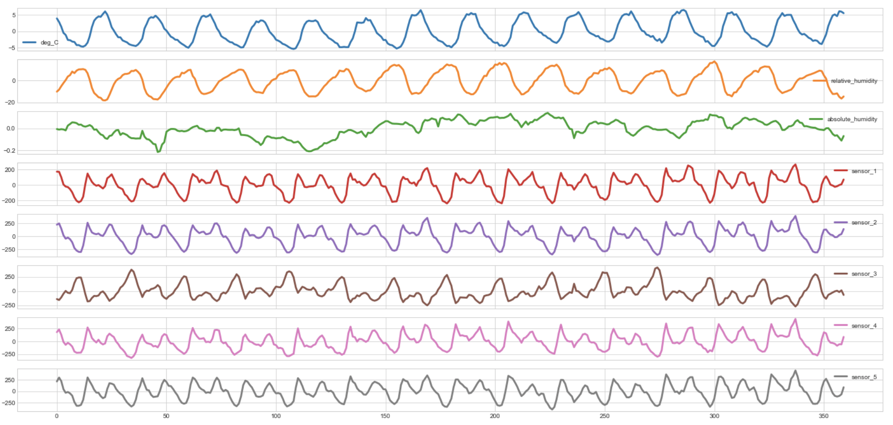

# Data Science Air Pollution Predictions: Project Overview

- Created models to help meteorologists estimate air pollution measurements (RMSLE ~ 0.233)
- Trained over 7000 entries of weather information and sensor data measurements
- Performed time series decomposition to visualize seasonality, trend, and residual patterns in data
- Engineered lag features based on autocorrelation and partial autocorrelation patterns
- Optimized CatBoostRegressors to reach the best hyperparameter tuned models
- Placed in top 27% of *Kaggle Tabular Playground Series - Jul 2021* competition
## Code and Resources Used

**Python Version:** 3.8.8\
**Packages:** pandas, numpy, sklearn, seaborn, matplotlib, pylab, statsmodels, catboost, warnings\
**For Web Framework Requirements:** ```pip install !catboost```\
**Competition Link:** https://www.kaggle.com/c/tabular-playground-series-jul-2021/overview

## Data Collection

The data was based on a real dataset, but with syntheticly-generated aspects to it.
The original dataset deals with predicting air pollution in a city via various input sensor values (e.g. a time series).

The basic weather information consisted of the following:

- Temperature in degrees Celsius
- Relative Humidity
- Absolute Humidity

The recorded sensor data included information from 5 sensors:
- Sensor 1
- Sensor 2
- Sensor 3
- Sensor 4
- Sensor 5

## Data Cleaning

After loading the data, it was already in good quality to be usable for the model. 
However, I made the following changes:
- Parsed numeric dates and times of out date_time column
- Created lag features for all original features based on their past values
- Imputed missing lag values
- Dropped original date_time column

I also made the following columns:
- year
- month
- day
- hour
- dayofweek_num

## EDA

I looked at the distributions of the data and the time series decomposition patterns. 
Below are a few tables to highlight:

<p align="center">
  
  
  
</p>


## Model Building

First, I scaled the features and log normalized the targets.

The train and test sets were already in separate csv files per the competition rules. 
I also split the train data into train and validation sets with a validation size of 20%.

I created three different **CatBoostRegressor** baseline models and evaluated them using Root Mean Square Log Error. 
I chose RMSLE because it was the evaluation metric used in the competition and it was relatively easy to interpret.

## Model Performance

Hyperparameter tuned three CatBoostRegressors for optimal evaluation RMSLE:
- num_leaves
- min_child_samples
- learning_rate
- max_depth
- max_bin

The best models performed with higher *num_leaves*, *min_child_samples*, *max_depth*, 
and with varying *learning_rate* and *max_bin* parameter values dependent on the target.
